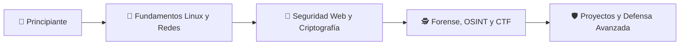

<!-- ============================================================= -->
<!--   README — CLUB DE CIBERSEGURIDAD                             -->
<!-- ============================================================= -->

<p align="center">
  
</p>

<p align="center">
  
</p>

<p align="center">
  <a href="[ENLACE_DISCORD]">
    
  </a>
  <a href="[ENLACE_LINKEDIN]">
    
  </a>
  <a href="mailto:[CORREO_DEL_CLUB]">
    
  </a>
</p>

<p align="center">
  
  
  
</p>

---

<p align="center">
  <a href="#-quiénes-somos">IDENTIDAD</a> •
  <a href="#-áreas-de-operación">ÁREAS</a> •
  <a href="#-próximas-misiones">MISIONES</a> •
  <a href="#-únete-al-club">UNIRSE</a> •
  <a href="#-código-de-conducta">ÉTICA</a>
</p>

<br>

🎯 Nuestra misión
🧠 Aprender	🛡️ Defender	🤝 Compartir
Desarrollar habilidades técnicas con laboratorios y retos reales.	Promover una cultura de prevención y seguridad digital.	Crear una comunidad abierta donde el conocimiento circule.


🧩 Áreas de operación
<table>
<tr>
<td width="50%" valign="top">

🌐 Seguridad Web
- OWASP Top 10
- Autenticación y sesiones
- Desarrollo seguro
- Análisis de vulnerabilidades
- Laboratorios web
</td>
<td width="50%" valign="top">

📡 Redes y Sistemas
- Análisis de tráfico
- Hardening
- Firewalls y monitoreo
- Linux y administración segura
- Respuesta a incidentes
</td>
</tr>
<tr>
<td width="50%" valign="top">

🔐 Criptografía
- Cifrado simétrico y asimétrico
- Hashes y firmas digitales
- Gestión de claves
- Esteganografía
- Retos Crypto CTF
</td>
<td width="50%" valign="top">

🕵️ Investigación Digital
- OSINT
- Forense digital
- Ingeniería inversa
- Análisis de malware
- Inteligencia de amenazas
</td>
</tr>
</table>


🧰 Arsenal de aprendizaje
<p align="center">
  
</p>

<p align="center">
  
  
  
  
  
</p>


📅 Próximas misiones
Fecha	Operación	Tipo	Estado
[DD/MM]	Introducción a Linux para Ciberseguridad	Taller	🟢 Abierto
[DD/MM]	Análisis de tráfico con Wireshark	Laboratorio	🟢 Abierto
[DD/MM]	CTF interno: Operation Zero Day	Competencia	🟡 Próximamente
[DD/MM]	OWASP Top 10: Seguridad Web	Charla	🟢 Abierto


Consulta la pestaña de Issues para proponer talleres, retos o proyectos.


🏴‍☠️ CTF y laboratorios
[✓] Web Exploitation
[✓] Cryptography
[✓] Digital Forensics
[✓] OSINT
[✓] Reverse Engineering
[✓] Network Analysis
[✓] Secure Coding
Nuestros retos se desarrollan únicamente en entornos controlados, educativos y autorizados.

🗺️ Ruta de aprendizaje



🤝 Únete al club
¿Quieres comenzar en ciberseguridad o profundizar tus conocimientos? No necesitas experiencia previa; solo curiosidad, compromiso y ganas de aprender.
1. Únete a nuestra comunidad en Discord.
2. Preséntate en el canal #bienvenida.
3. Revisa el calendario de próximas actividades.
4. Participa en un taller o reto.
5. Comparte tus ideas y crea con nosotros.
<p align="center">
  <a href="[ENLACE_FORMULARIO]">
    
  </a>
</p>


⚖️ Código de conducta
[!WARNING]
La ciberseguridad exige responsabilidad. Todo conocimiento y herramienta compartida en esta comunidad debe utilizarse exclusivamente con fines educativos, defensivos y legales.

- Respeta la privacidad y los sistemas de otras personas.
- Nunca realices pruebas sin autorización explícita.
- Comparte conocimiento para proteger, no para perjudicar.
- Mantén un ambiente inclusivo, respetuoso y colaborativo.
- Reporta conductas inapropiadas al equipo organizador.

👥 Equipo organizador
Rol	Responsable	Contacto
🧭 Presidencia	[Nombre]	[Contacto]
⚙️ Coordinación técnica	[Nombre]	[Contacto]
📢 Comunicación	[Nombre]	[Contacto]
🧪 Mentores	[Nombre(s)]	[Contacto]


📚 Recursos recomendados
- OWASP Top 10
- PortSwigger Web Security Academy
- TryHackMe
- Hack The Box Academy
- OverTheWire
- CISA — Recursos de ciberseguridad

<p align="center">
  
</p>

<p align="center">
  <code>root@Daemons Wolves:~$ echo "Aprender. Proteger. Compartir."</code>
</p>

<p align="center">
  <b>🛡️ Construyendo una comunidad más segura, una habilidad a la vez. 🛡️</b>
</p>
```

## 🛰️ Quiénes somos

```console
┌──(Daemons Wolves@cybersecurity)-[~/community]
└─$ whoami

Somos una comunidad estudiantil dedicada a aprender, compartir y
aplicar conocimientos de ciberseguridad de forma ética, responsable
y colaborativa.
