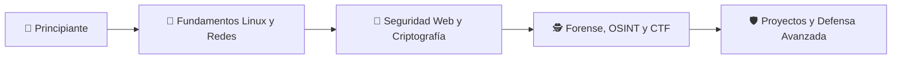

<!-- ============================================================= -->
<!--   README — DAEMONS WOLVES | FMAT                             -->
<!-- ============================================================= -->

<p align="center">
  
</p>

<p align="center">
  
</p>

<p align="center">
  <a href="[ENLACE_DISCORD]">
    
  </a>
  <a href="[ENLACE_LINKEDIN]">
    
  </a>
  <a href="mailto:[CORREO_DEL_CLUB]">
    
  </a>
</p>

<p align="center">
  
  
  
</p>

---

<p align="center">
  <a f="#-quiénes-somos">NINGÚN SISTEMA ES SEGURO</a> |
  <a href="#-áreas-de-operación">ÁREAS</a> •
  <a href="#-próximas-misiones">MISIONES</a> •
  <a href="#-únete-al-club">UNIRSE</a> |
  <a f="#-código-de-conducta">APUNTA A LO IMPOSIBLE</a>
  
</p>

<br>

## 🛰️ Quiénes somos

```console
┌──(daemons-wolves@fmat)-[~/community]
└─$ whoami

Somos una comunidad estudiantil dedicada a aprender, compartir y
aplicar conocimientos de ciberseguridad de forma ética, responsable
y colaborativa.
```

Nuestro objetivo es formar personas capaces de comprender los riesgos digitales, proteger sistemas y construir un internet más seguro.

> “No se trata solo de encontrar vulnerabilidades; se trata de entender cómo proteger a las personas.”

<br>

## 🎯 Nuestra misión

| 🧠 Aprender | 🛡️ Defender | 🤝 Compartir |
|:---:|:---:|:---:|
| Desarrollar habilidades técnicas con laboratorios y retos reales. | Promover una cultura de prevención y seguridad digital. | Crear una comunidad abierta donde el conocimiento circule. |

<br>

## 🧩 Áreas de operación

> “Se consiente...”

<table>
<tr>
<td width="50%" valign="top">

### 🌐 Seguridad Web

- OWASP Top 10
- Autenticación y sesiones
- Desarrollo seguro
- Análisis de vulnerabilidades
- Laboratorios web

</td>
<td width="50%" valign="top">

### 📡 Redes y Sistemas

- Análisis de tráfico
- Hardening
- Firewalls y monitoreo
- Linux y administración segura
- Respuesta a incidentes

</td>
</tr>
<tr>
<td width="50%" valign="top">

### 🔐 Criptografía

- Cifrado simétrico y asimétrico
- Hashes y firmas digitales
- Gestión de claves
- Esteganografía
- Retos Crypto CTF

</td>
<td width="50%" valign="top">

### 🕵️ Investigación Digital

- OSINT
- Forense digital
- Ingeniería inversa
- Análisis de malware
- Inteligencia de amenazas

</td>
</tr>
</table>

> “El mayor fallo de seguridad está frente al monitor...”

<br>

## 🧰 Arsenal de aprendizaje

<p align="center">
  
</p>

<p align="center">
  
  
  
  
  
</p>

<br>

## 📅 Próximas misiones

| Fecha | Operación | Tipo | Estado |
|:---:|---|---|:---:|
| `[DD/MM]` | Introducción a Linux para Ciberseguridad | Taller | 🔵 Abierto |
| `[DD/MM]` | Análisis de tráfico con Wireshark | Laboratorio | 🔵 Abierto |
| `[DD/MM]` | CTF interno: *Operation Zero Day* | Competencia | 🟦 Próximamente |
| `[DD/MM]` | OWASP Top 10: Seguridad Web | Charla | 🔵 Abierto |

> Consulta la pestaña de [Issues](../../issues) para proponer talleres, retos o proyectos.

<br>

## 🏴‍☠️ CTF y laboratorios

```text
[✓] Web Exploitation     [✓] Cryptography
[✓] Digital Forensics    [✓] OSINT
[✓] Reverse Engineering  [✓] Network Analysis
[✓] Secure Coding        [✓] Blue Team Fundamentals
```


Nuestros retos se desarrollan únicamente en entornos controlados, educativos y autorizados.

<br>

## 🗺️ Ruta de aprendizaje



<br>

## 🤝 Únete al club

¿Quieres comenzar en ciberseguridad o profundizar tus conocimientos? No necesitas experiencia previa; solo curiosidad, compromiso y ganas de aprender.

1. Únete a nuestra comunidad en [Discord]([ENLACE_DISCORD]).
2. Preséntate en el canal `#bienvenida`.
3. Revisa el calendario de próximas actividades.
4. Participa en un taller o reto.
5. Comparte tus ideas y crea con nosotros.

<p align="center">
  <a href="[ENLACE_FORMULARIO]">
    
  </a>
</p>

<br>

## ⚖️ Código de conducta

> [!WARNING]
> La ciberseguridad exige responsabilidad. Todo conocimiento y herramienta compartida en esta comunidad debe utilizarse exclusivamente con fines educativos, defensivos y legales.

- Respeta la privacidad y los sistemas de otras personas.
- Nunca realices pruebas sin autorización explícita.
- Comparte conocimiento para proteger, no para perjudicar.
- Mantén un ambiente inclusivo, respetuoso y colaborativo.
- Reporta conductas inapropiadas al equipo organizador.

<br>

## 👥 Equipo organizador

| Rol | Responsable | Contacto |
|---|---|---|
| 🧭 Presidencia | `[Nombre]` | `[Contacto]` |
| ⚙️ Coordinación técnica | `[Nombre]` | `[Contacto]` |
| 📢 Comunicación | `[Nombre]` | `[Contacto]` |
| 🧪 Mentores | `[Nombre(s)]` | `[Contacto]` |

<br>

## 📚 Recursos recomendados

- [OWASP Top 10](https://owasp.org/www-project-top-ten/)
- [PortSwigger Web Security Academy](https://portswigger.net/web-security)
- [TryHackMe](https://tryhackme.com/)
- [Hack The Box Academy](https://academy.hackthebox.com/)
- [OverTheWire](https://overthewire.org/wargames/)
- [CISA — Recursos de ciberseguridad](https://www.cisa.gov/)

<p align="center">
  
</p>

<p align="center">
  <code>root@daemons-wolves:~$ echo &quot;Aprender. Proteger. Compartir.&quot;</code>
</p>

<p align="center">
  <b>🛡️ Construyendo una comunidad más segura, una habilidad a la vez. 🛡️</b>
</p>
